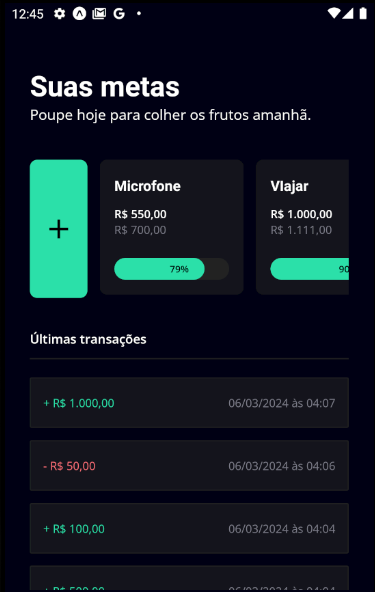
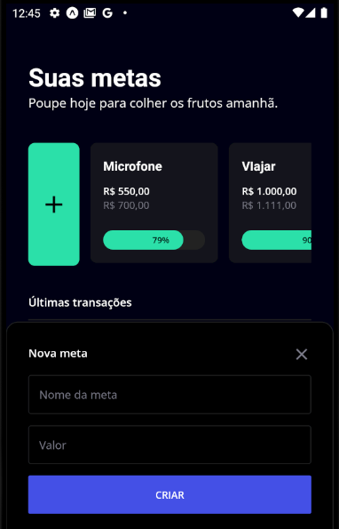
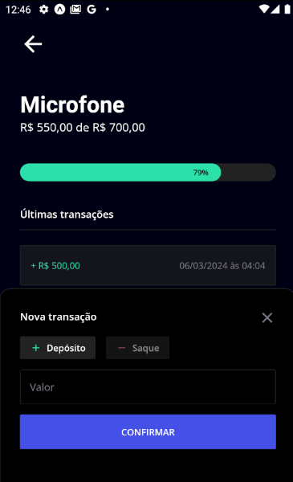

<p align="left">

  
  

  

</p>

### Tópicos

:small_blue_diamond: [Sobre o Projeto](#star-sobre-o-projeto)

:small_blue_diamond: [Objetivo](#dart-objetivo)

:small_blue_diamond: [Imagens](#sunrise_over_mountains-imagens)

:small_blue_diamond: [Funcionalidades](#bookmark_tabs-funcionalidades)

:small_blue_diamond: [Como rodar a aplicação](#arrow_forward-como-rodar-a-aplicação)

## :star: Sobre o Projeto

Aplicativo desenvolvido durante o evento React Native na Prática, organizado pela Rocketseat (https://www.rocketseat.com.br/).

Este projeto foi desenvolvido utilizando:

:heavy_check_mark: Expo

:heavy_check_mark: React Native

:heavy_check_mark: Tailwind (Nativewind)

:heavy_check_mark: SQLite como Banco de Dados

## :dart: Objetivo

Desenvolvimento de uma aplicação para gerenciamento de metas pessoais

## :bookmark_tabs: Funcionalidades

:white_check_mark: Gerenciamento da Meta

:white_check_mark: Nova Meta

:white_check_mark: Nova Transação

## :sunrise_over_mountains: Imagens

<details>
<summary> Imagens da Aplicação </summary>





</details>

## :arrow_forward: Como rodar a aplicação

#### :heavy_check_mark: Clonando o Projeto

- No terminal, clone o projeto:

  ```
  https://github.com/dgo-angelo/react-native-na-pratica-my-goals.git
  ```

### :arrow_forward: Executando a aplicação

- Acessar a pasta raiz do projeto e instalar as dependências através do comando:

```
npm install
```

- Após instalação das dependências, é só iniciar o projeto em um emulador ou dispositivo físico.

```
npm start
```

<hr/>
